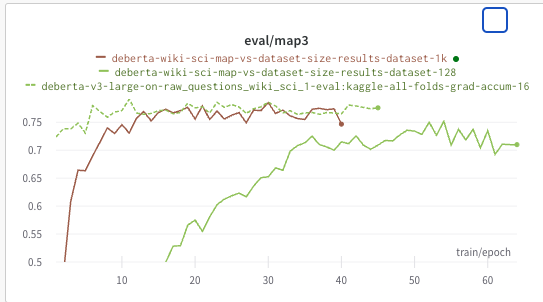

# Submissions

These are actually bad submissions! These were trained on Kaggle data!

- [deberta-v3-large-on-raw_questions_wiki_sci_1-eval-kaggle-all-folds-grad-accum-16](https://www.kaggle.com/code/viktorcikojevic/kaggle-llm?scriptVersionId=141219820) submission, publice score: 0.713. Local CV was about 0.77. Training data: Kaggle data. Here I made the mistake, I thought that I was training on wiki_sci data, but I was actually training on Kaggle data.
- [deberta-v3-data-mix-1-eval-kaggle-all-folds-grad-accum-128](https://www.kaggle.com/code/viktorcikojevic/kaggle-llm?scriptVersionId=141282948) submission, publice score: 0.729. Local CV was about 0.84. Train data: Kaggle + 15k dataset. Here I made the mistake, I thought that I was training on wiki_sci data, but I was actually training on Kaggle data.
- [deberta-v3-data-mix-1-eval-kaggle-all-folds-grad-accum-128](https://www.kaggle.com/code/viktorcikojevic/kaggle-llm?scriptVersionId=141282948) submission, publice score: 0.729. Local CV was about 0.84. Train data: Kaggle + 15k dataset. Here I made the mistake, I thought that I was training on wiki_sci data, but I was actually training on Kaggle data.

- [deberta-v3-data-mix-1-eval-kaggle-all-folds-grad-accum-128-ACTUAL](https://www.kaggle.com/code/viktorcikojevic/kaggle-llm?scriptVersionId=141354264): public score 0.738, local score 0.84. Train data: wiki-sci-1 + 15k dataset.
- [deberta-wiki-sci-map-vs-dataset-size/results-dataset-all](https://www.kaggle.com/code/viktorcikojevic/kaggle-llm?scriptVersionId=141330398): public score 0.738, local score 0.84. Train data: only the wiki-sci-1 dataset.

# Experiment Log

## 2023-08-28

- [deberta-v3-large-on-raw_questions_wiki_sci_1-eval-kaggle-all-folds-grad-accum-16](https://www.kaggle.com/code/viktorcikojevic/kaggle-llm?scriptVersionId=141219820) submission, publice score: 0.713. Local CV was about 0.77

- [wiki sci 1 with context](https://wandb.ai/viktor-cikojevic/huggingface/reports/Untitled-Report--Vmlldzo1MjUzODM3/edit?firstReport&runsetFilter)  reaches local CV about 0.68. Maybe the model is struggling to lear here since it ways given too much context.

- I've analyzed the dependence of local CV vs the number of training data, using deberta and wiki-sci-1 (a dataset I created with gpt-3.5 and scientific wiki). I see that the eval map3  practically converges with about 1k samples from a 5k dataset.

<!--  -->

## 2023-08-27

- important insight. Here is the distribution of max dot products between a given encoded prompts and all of wiki_sci texts. In other words, I find the maximum cosine similarity for a given embedded prompt with a pool of wiki text embeddings. The left distribution is for Kaggle train dataset, the right one is a mix of wiki_sci (a generated dataset), mixed with the "15k" dataset. You can see that "15k" dataset contains a lof of non-sci texts, which is why the distribution is so different. On the second figure below you can see the dot products with solely the wiki_sci dataset. You can see that wiki_sci distribution is much more similar to the Kaggle train dataset. 
<!--  -->

- Viktor: performed Deberta experiments using "teacher" schema, where the model sees all possible answers. Check the report [on wanbd here](https://api.wandb.ai/links/viktor-cikojevic/6rax1t92). My conclusion is that since the local CV scores the same as before, this training scheme doesn't really help.

## 2023-08-24

-    Viktor: performed bunch of Deberta experiments [on wanbd here](https://wandb.ai/viktor-cikojevic/huggingface/reports/Untitled-Report--Vmlldzo1MjIyNzc3). My conclusions:

-  gradient accumulation works pretty well in these experiments!

- loss function is aligned with the metric only at the beginning of the training. After the model starts to overfit, you can see that the metric stays the same while the eval loss increases.

- When evaluating of fold 0 (out of 10) of Kaggle dataset, it is the same whether we train on Kaggle data or wiki_sci `data/kaggle-llm-science-exam-splitted/more_questions_raw_questions_wiki_sci_1_test.csv` dataset. This gives me hope that we can continue training on wiki_sci and evaluate on Kaggle data.

- When evaluating on all Kaggle data, the score is ~0.78, while when evaluating on the first fold of Kaggle data, the score is ~0.9. 

## Typical workflow

### Data generation

- [data_llm_generate_question_wiki_sci.ipynb](../notebooks/data_llm_generate_question_wiki_sci.ipynb): generates questions based on all sci wiki texts gpt3.5

### Data splitting

- [notebooks/data_splitter.ipynb](notebooks/data_splitter.ipynb): splits data into train and test. Shuffles the possible answers and saves the data in a csv.

